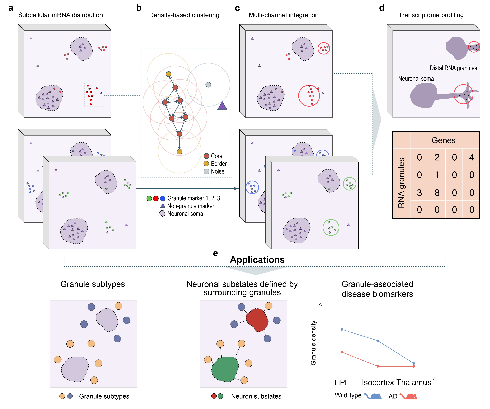

# mcDETECT

## Uncovering the dark transcriptome in polarized neuronal compartments with mcDETECT

#### Chenyang Yuan, Krupa Patel, Hongshun Shi, Hsiao-Lin V. Wang, Feng Wang, Ronghua Li, Yangping Li, Victor G. Corces, Hailing Shi, Sulagna Das, Jindan Yu, Peng Jin, Bing Yao* and Jian Hu*

mcDETECT is a machine learning framework to systematically identify and profile distal RNA granules using *in situ* spatial transcriptomics (iST) data. Given an input list of granule markers, mcDETECT first employs density-based clustering to pinpoint the extrasomatic mRNA aggregates for each gene. It then iteratively merges aggregates from different markers that have high spatial overlap. Multiple filtering steps ensure these aggregates fall outside neuronal somata and do not contain negative controls, and the retained aggregates are considered individual granules. Finally, mcDETECT assigns surrounding mRNA molecules to each granule to reconstruct their transcriptome profile.

<br>

## Installation

To install `mcDETECT` package you must make sure that your python version is over 3.6. If you don’t know the version of python you can check it by:

```python
import platform
platform.python_version()
```

Now you can install the current release of `mcDETECT` by the following three ways:

### 1. PyPI

Directly install the package from PyPI:

```bash
# Note: you need to make sure that the pip is for python3
pip3 install mcDETECT

# If you do not have permission (when you get a permission denied error), you should run:
pip3 install --user mcDETECT

# Or you could run:
python3 -m pip install mcDETECT
```

### 2. GitHub

Download the package from Github and install it locally:

```bash
git clone https://github.com/chen-yang-yuan/mcDETECT
cd mcDETECT/mcDETECT_package
python3 setup.py install --user
```

## Dependencies

### Python

Python support packages: anndata, miniball, numpy, pandas, rtree, scanpy, scipy, shapely, sklearn.

### Versions the software has been tested on

Environment 1:

* System: macOS Sequoia 15.3.1 (Apple M2 Max)
* Python: 3.11.4
* Python packages: anndata = 0.9.1, miniball = 1.2.0, numpy = 1.24.3, pandas = 2.0.2, rtree = 1.2.0, scanpy = 1.10.3, scipy = 1.10.1, shapely = 2.0.1, sklearn = 1.2.2

Environment 2:
* System: macOS Sequoia 15.3.1 (Apple M1 Pro)
* Python: 3.9.12
* Python packages: anndata = 0.8.0, miniball = 1.2.0, numpy = 1.23.5, pandas = 2.2.3, rtree = 0.9.7, scanpy = 1.10.3, scipy = 1.13.1, shapely = 2.0.1, sklearn = 1.5.2

## Tutorial

For a step-by-step tutorial on `mcDETECT`, please see [tutorial](tutorial/tutorial.md).<br>

Toy datasets used in this tutorial can be downloaded from [Dropbox](https://www.dropbox.com/scl/fo/gxt64ilg55p44iwj1dox3/AO-LRvZUQnJU9twvtaEdpcY?rlkey=bjk5dv5sqnhinblapr12wtzau&st=owdm92gz&dl=0).

## Contributing

Source code: [mcDETECT_package](mcDETECT_package).<br>

We are continuing adding new features. Bug reports or feature requests are welcome.<br>

Last update: 08/11/2025, version 2.0.0.

## Citation