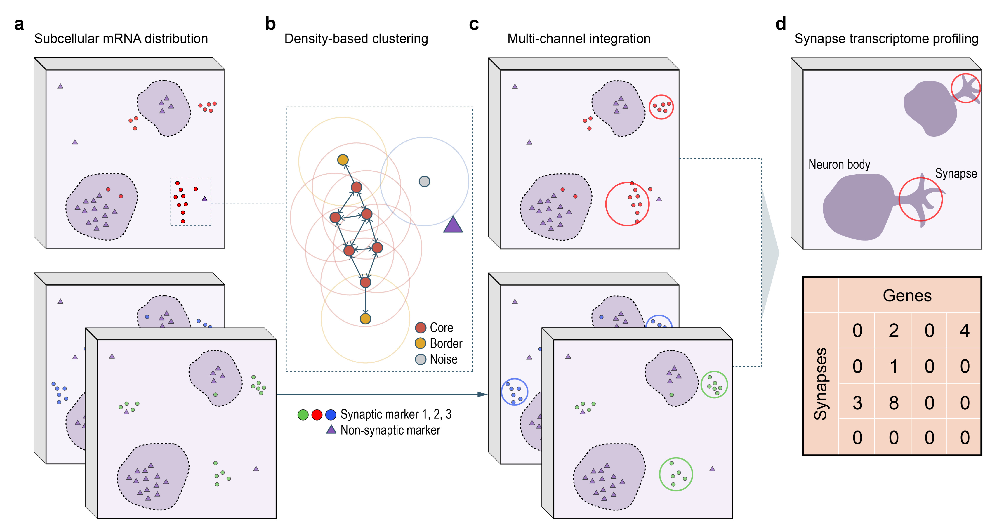

# mcDETECT

## mcDETECT: Decoding 3D Spatial Synaptic Transcriptomes with Subcellular-Resolution Spatial Transcriptomics

#### Chenyang Yuan, Krupa Patel, Hongshun Shi, Hsiao-Lin V. Wang, Feng Wang, Ronghua Li, Yangping Li, Victor G. Corces, Hailing Shi, Sulagna Das, Jindan Yu, Peng Jin, Bing Yao* and Jian Hu*

mcDETECT is a computational framework designed to identify and profile individual synapses using *in situ* spatial transcriptomics (iST) data. It starts by examining the subcellular distribution of synaptic mRNAs in an iST sample. Unlike cell-type specific marker genes, which are typically found within nuclei, mRNAs of synaptic markers often form small aggregations outside the nuclei. mcDETECT uses a density-based clustering approach to identify these extranuclear aggregations. This involves calculating the Euclidean distance between mRNA points and defining the neighborhood of each point within a specified search radius. Points are then categorized into core points, border points, and noise points based on their reachability from neighboring points. mcDETECT recognizes each bundle of core and border points as a synaptic aggregation. To minimize false positives, it excludes aggregations that significantly overlap with nuclei identified by DAPI staining. Subsequently, mcDETECT repeats this process for multiple synaptic markers, merging aggregations from different markers with high overlaps. After encompassing all markers, an additional filtering step is performed to remove aggregations that contain mRNAs from negative control genes, which are known to be enriched only in nuclei. The remaining aggregations are considered individual synaptic aggregations. mcDETECT then uses the minimum enclosing sphere of each aggregation to gather all mRNA molecules and summarizes their counts for all measured genes to define the spatial transcriptome profile of individual synapses.

<br>

## Installation

To install `mcDETECT` package you must make sure that your python version is over 3.6. If you don’t know the version of python you can check it by:

```python
import platform
platform.python_version()
```

Now you can install the current release of `mcDETECT` by the following three ways:

### 1. PyPI

Directly install the package from PyPI:

```bash
# Note: you need to make sure that the pip is for python3
pip3 install mcDETECT

# If you do not have permission (when you get a permission denied error), you should run:
pip3 install --user mcDETECT

# Or you could run:
python3 -m pip install mcDETECT
```

### 2. GitHub

Download the package from Github and install it locally:

```bash
git clone https://github.com/chen-yang-yuan/mcDETECT
cd mcDETECT/mcDETECT_package
python3 setup.py install --user
```

## Dependencies

### Python

Python support packages: anndata, miniball, numpy, pandas, rtree, scanpy, scipy, shapely, sklearn.

### Versions the software has been tested on

Environment 1:

* System: macOS Sequoia 15.3.1 (Apple M2 Max)
* Python: 3.11.4
* Python packages: anndata = 0.9.1, miniball = 1.2.0, numpy = 1.24.3, pandas = 2.0.2, rtree = 1.2.0, scanpy = 1.10.3, scipy = 1.10.1, shapely = 2.0.1, sklearn = 1.2.2

## Tutorial

For a step-by-step tutorial on `mcDETECT`, please see [tutorial](tutorial/tutorial.md).<br>

Toy datasets used in this tutorial can be downloaded from [Dropbox](https://www.dropbox.com/scl/fo/gxt64ilg55p44iwj1dox3/AO-LRvZUQnJU9twvtaEdpcY?rlkey=bjk5dv5sqnhinblapr12wtzau&st=owdm92gz&dl=0).

## Contributing

Source code: [mcDETECT_package](mcDETECT_package).<br>

We are continuing adding new features. Bug reports or feature requests are welcome.<br>

Last update: 02/27/2025, version 1.0.7.

## Citation