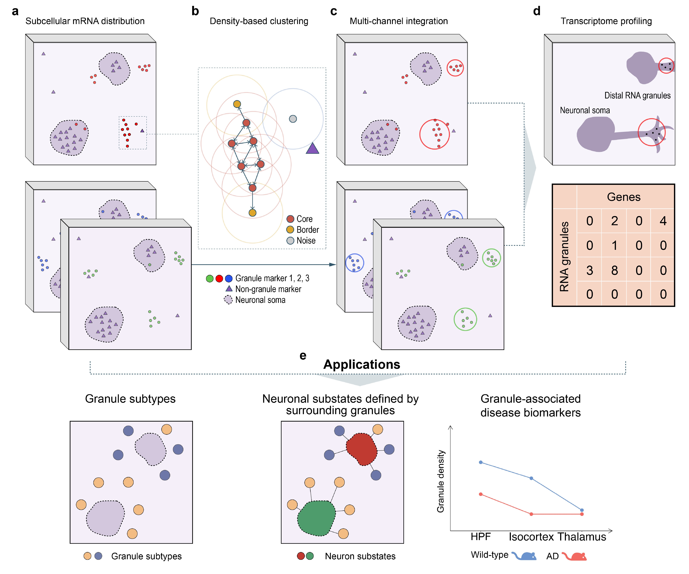

# mcDETECT v2.1.1

## Uncovering the dark transcriptome in polarized neuronal compartments with mcDETECT

#### Chenyang Yuan, Krupa Patel, Hongshun Shi, Hsiao-Lin Wang, Feng Wang, Ronghua Li, Yangping Li, Victor Corces, Hailing Shi, Sulagna Das, Jindan Yu, Peng Jin, Bing Yao* and Jian Hu*

mcDETECT is a computational framework designed to study the dark transcriptome related to polarized compartments in brain using *in situ* spatial transcriptomics (iST) data. It begins by examining the subcellular distribution of mRNAs in an iST sample. Each mRNA molecule is treated as a distinct point with its own 3D spatial coordinates considering the thickness of the sample. Unlike many cell-type marker genes, which are typically found within the nucleus or soma, compartmentalized mRNAs often form small aggregates outside the soma. mcDETECT uses a density-based clustering approach to identify these extrasomatic aggregates. This involves calculating the Euclidean distance between mRNA points and defining the neighborhood of each point within a specified search radius. Points are then categorized as core points, border points, or noise points based on their reachability from neighboring points. mcDETECT recognizes each connected bundle of core and border points as a mRNA aggregate. To minimize false positives, it excludes aggregates that substantially overlap with somata, which are estimated by dilating the nuclear masks derived from DAPI staining. mcDETECT then repeats this process for multiple granule markers, merging aggregates from different markers that exhibit high spatial overlap. After aggregating across all markers, an additional filtering step removes aggregates containing mRNAs from negative control genes, which are known to be enriched exclusively in nuclei and somata. The remaining aggregates are considered individual RNA granules. mcDETECT then computes the minimum enclosing sphere for each aggregate to connect neighboring mRNA molecules from all measured genes and summarizes their counts, thereby defining the spatial transcriptome profile of individual RNA granules.

<br>

## Installation

### Recommended: Use the reproducible Conda environment

To ensure a smooth setup and full reproducibility of the mcDETECT pipeline and analyses, we provide a Conda environment specification file: [env.yaml](code/utils/env.yaml). We recommend creating the environment as follows:

```bash
git clone https://github.com/chen-yang-yuan/mcDETECT
cd mcDETECT/code/utils
conda env create -f env.yaml
conda activate mcDETECT-env
```

This environment contains a tested Python version and all required dependencies for running mcDETECT and the associated analysis scripts in this repository.

### Alternative: Install mcDETECT as a Python package

If you only want to use mcDETECT as a Python package and do not need the full analysis environment, you can install it either from PyPI or directly from the GitHub repository.

**Requirement:** Python ≥ 3.6

Check your Python version:

```python
import platform
platform.python_version()
```

#### 1. Install from PyPI

```bash
pip3 install mcDETECT
```

If you encounter permission issues:

```bash
pip3 install --user mcDETECT
```

Or:

```bash
python3 -m pip install mcDETECT
```

#### 2. Install from GitHub

```bash
git clone https://github.com/chen-yang-yuan/mcDETECT
cd mcDETECT/mcDETECT_package
python setup.py install --user
```

## Dependencies

### Core Python dependencies

mcDETECT relies on a standard scientific Python stack for spatial transcriptomics and image-based analysis, including:
* anndata
* miniball
* numpy
* pandas
* rtree
* scikit-learn
* scipy
* shapely

The exact versions used for development and analysis are recorded in [env.yaml](code/utils/env.yaml).

### Tested environments

In addition to the provided `env.yaml`, mcDETECT has been tested in the following environments:

Environment 1

* System: macOS Sequoia 15.3.1 (Apple M2 Max)
* Python: 3.11.4
* Python packages: anndata = 0.9.1, miniball = 1.2.0, numpy = 1.24.3, pandas = 2.0.2, rtree = 1.2.0, scipy = 1.10.1, shapely = 2.0.1, sklearn = 1.2.2

Environment 2
* System: macOS Sequoia 15.3.1 (Apple M1 Pro)
* Python: 3.9.12
* Python packages: anndata = 0.8.0, miniball = 1.2.0, numpy = 1.23.5, pandas = 2.2.3, rtree = 0.9.7, scipy = 1.13.1, shapely = 2.0.1, sklearn = 1.5.2

## Tutorial

For a step-by-step tutorial on mcDETECT, please see [tutorial](tutorial/tutorial.md).<br>

Toy datasets used in this tutorial can be downloaded from [Dropbox](https://www.dropbox.com/scl/fo/gxt64ilg55p44iwj1dox3/AO-LRvZUQnJU9twvtaEdpcY?rlkey=bjk5dv5sqnhinblapr12wtzau&st=owdm92gz&dl=0).

## Contributing

Source code: [mcDETECT_package](mcDETECT_package).<br>

We are continuing adding new features. Bug reports or feature requests are welcome.<br>

Last update: 02/10/2026, version 2.1.1.

## Citation